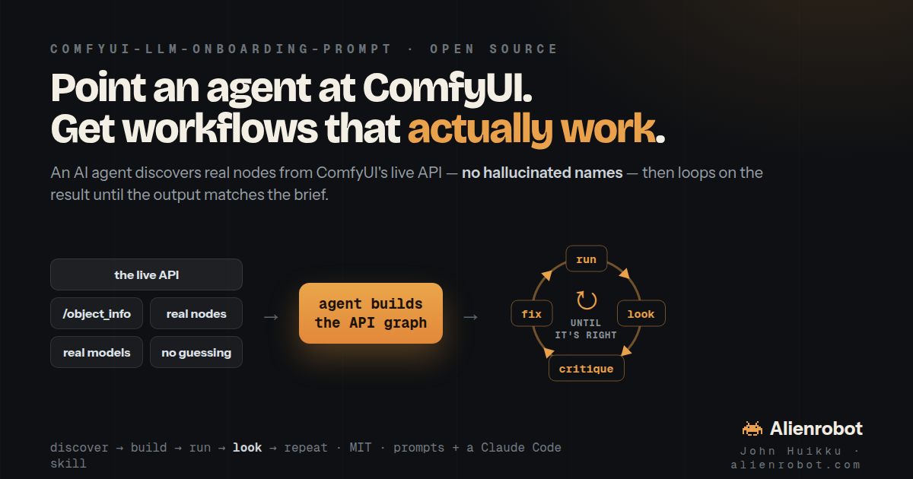

# ComfyUI LLM Onboarding Prompt



**Teach any LLM to build ComfyUI workflows that actually run — and then keep iterating until the output is right.**

Ask a stock LLM to "make me a ComfyUI workflow" and you get confident JSON full of node names that don't exist, parameters that don't match, and model files you've never downloaded. The fix is simple: ComfyUI already exposes a REST API (`/object_info`) that lists every installed node, its exact inputs/outputs/types, and the model files actually on disk. These prompts teach the model to **query that API before writing any JSON**, **validate by executing**, and **look at the rendered output and fix it** instead of handing you an untested graph.

Two ideas, and everything here is built on them:

1. **Discover, don't guess.** Read the real node + model truth from the live API. Never invent a name, type, or filename.
2. **Validate by looking.** A graph with zero errors is *valid, not correct* — drift, seams, mangled hands, an over-strong effect only show up in the pixels. So run it, look, critique against the intent, change one thing, and repeat.

---

## What's in here

| File | What it is | Reach for it when |
|---|---|---|
| **[`COMFYUI_WORKFLOW_LOOP_PROMPT.md`](COMFYUI_WORKFLOW_LOOP_PROMPT.md)** | **The flagship.** A self-contained prompt that builds *and* loops — discover → build → run → **look** → critique → fix — autonomously, until the result meets the brief, then checkpoints with you for sign-off. Includes node-install / custom-node permission and heavy-job (video/batch) iteration guidance. | You want a *good result*, not just a runnable graph — let an agent grind on the output until it's right. |
| **[`ONBOARDING_PROMPT-v2.md`](ONBOARDING_PROMPT-v2.md)** | The build-and-validate prompt: picks the right JSON format, verifies model files exist, and **executes the workflow** to debug from real errors before declaring it done. | You mainly need a *correct, validated* workflow and will judge the output yourself. |
| **[`ONBOARDING_PROMPT-v1.md`](ONBOARDING_PROMPT-v1.md)** | The original, node-discovery-only prompt — teaches the model to query `/object_info` so it stops inventing node names. Small and simple. | All you want is correct node usage, no execution loop. |
| **[`SKILL.md`](SKILL.md)** | The same method packaged as a **Claude Code skill** — auto-loads when you ask about ComfyUI workflows, no pasting. | You're in Claude Code and want this behavior to just happen. |
| **[`mcp/`](mcp/)** | **comfy-mcp** — the whole method as a loop-aware **MCP server** for your own ComfyUI: 22 tools (discover real nodes/models, search + run the official template catalog, install missing packs/models, submit, fetch the pixels so the agent can *look*), plus the loop served as MCP prompts. See [`mcp/README.md`](mcp/README.md) and the honest [Cloud-MCP comparison](mcp/README.md#how-it-compares-to-comfyui-cloud-mcp). | Your agent speaks MCP and you want tools, not pasted prompts — running against your own install, local and private. |

If you only read one prompt, read **`COMFYUI_WORKFLOW_LOOP_PROMPT.md`** — it supersets the others. If your agent speaks MCP, install **`mcp/`** and get the same loop as tools.

---

## The loop

```
        ┌─────────────────────────────────────────────────────┐
        │                                                (next pass)
        ▼                                                     │
  BUILD / ADJUST ──▶ RUN ──▶ LOOK ──▶ CRITIQUE ──▶ DECIDE ──┘
   one change      /prompt   fetch &   name the    defect? → fix & loop
   per pass        + fix     actually  specific    none?   → present &
                   errors    view it   defect              ask for sign-off
```

- **Discover, don't guess** — `/object_info` for node specs; loader **enums** for the only valid model files.
- **Build API format** — the flat, runnable graph you POST to `/prompt` (not the drag-onto-canvas file; ask for that separately).
- **The inner loop** — `node_errors` means *not yet running*; read it, fix that node, re-POST. That's not an iteration.
- **The outer loop** — once it runs, *look*. Iterate on **parameters** (denoise, cfg, mask feather, seed…), one change per pass, until a VFX eye would accept it.
- **The ratchet** — hold a *best-so-far*; keep a change only if it beats it, otherwise **revert** and try something different (no building on regressions). Gate on an objective test when the brief has one (seamless tile, exact count, identity preserved); judge by eye for aesthetics. Pivot param → wiring → model when passes plateau.
- **Convergence checkpoint** — when it can no longer name a real defect, it stops, presents the output + graph + a per-pass *loop ledger*, and asks you to approve or request changes.

The ratchet + ledger + pivot are adapted from [Andrej Karpathy's **AutoResearch** loop](https://www.nextbigfuture.com/2026/03/andrej-karpathy-on-code-agents-autoresearch-and-the-self-improvement-loopy-era-of-ai.html) (keep-or-revert against a best-so-far, an append-only experiment ledger, escalate on plateau) — adapted for *subjective* image work: an objective gate only where the brief has one, the eye elsewhere, and a human sign-off checkpoint instead of running forever.

---

## Use it

**Paste it.** Start ComfyUI (`http://localhost:8188`), copy the contents of `COMFYUI_WORKFLOW_LOOP_PROMPT.md` into your agent, then give it a goal.

**Point an agent at it.** If your agent can fetch URLs, just hand it the raw link:
```
https://raw.githubusercontent.com/huikku/comfyui-llm-onboarding-prompt/main/COMFYUI_WORKFLOW_LOOP_PROMPT.md
```

**Install the skill (Claude Code).** Drop the skill where Claude Code finds it and it auto-loads on any ComfyUI request:
```bash
mkdir -p ~/.claude/skills/comfyui-workflows
curl -sL https://raw.githubusercontent.com/huikku/comfyui-llm-onboarding-prompt/main/SKILL.md \
  -o ~/.claude/skills/comfyui-workflows/SKILL.md
```

**Install the MCP server (any MCP client).** The same loop as 22 tools against your own ComfyUI:
```bash
git clone https://github.com/huikku/comfyui-llm-onboarding-prompt && cd comfyui-llm-onboarding-prompt/mcp
pip install -e .
claude mcp add comfyui -- comfy-mcp        # or wire `comfy-mcp` into any MCP client config
```

### What to ask for

The loop earns its keep on tasks where the *first* result runs but a trained eye rejects it — exactly the iteration these prompts drive:

- *"Generate exactly three red apples and one yellow lemon in a white bowl — count and arrangement exactly right."* (composition)
- *"Make a seamlessly tileable 1024² stone texture and prove it tiles with no visible seam."* (a comparison test)
- *"4× upscale and restore this small portrait without changing the person's identity."* (pure parameter tuning)
- *"Relight this element to match a plate's key light so it composites believably."* (integration)
- *"Pull a broadcast-quality matte including flyaway hair — no fringe, no matte lines."* (edge craft)

---

## Quick test

With ComfyUI running, confirm the API is there — this is the same call the prompts lean on:

```bash
curl -s http://localhost:8188/object_info | python3 -c "
import json, sys
nodes = json.load(sys.stdin)
print(f'{len(nodes)} nodes installed')
for name in sorted(nodes)[:10]:
    print(f'  {name}')
print('  ...')
"
```

## Works with

- **Any LLM with terminal access** — Claude Code, Cursor, Windsurf, Gemini Code Assist, etc.
- **Any ComfyUI install** — stock or loaded with custom nodes (the API reflects whatever's installed).
- **Any OS.**

## License

MIT — use it however you want.

---

Built by **John Huikku** · [alienrobot.com](https://alienrobot.com)
